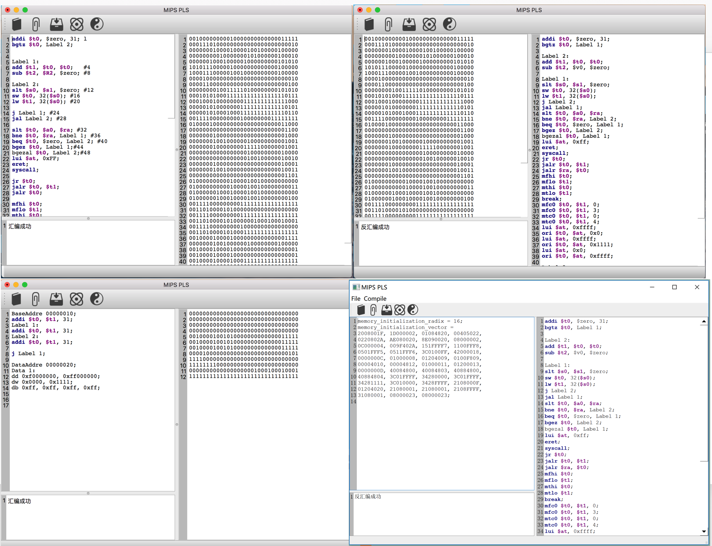

# README

> MipsPLS: MIPS Please!

A mips assembler developed with C++ and Qt 5.10 , featured:

1. support of both MacOS and Windows;
2. support of syntax highlighting;
3. support of Assembly and Disassembly;
4. full support of all MIPS instructions and several fake instructions like `li`, `la`, `move`, `BaseAddre`;

## screenshots

## contributors

- [Yeeef](https://github.com/Yeeef)

